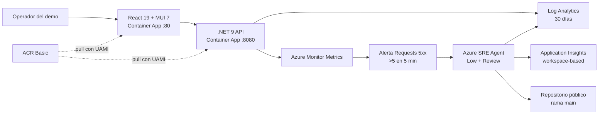

# Grifols Plasma Supply — demo técnico de Azure SRE Agent

> **Aviso obligatorio:** este repositorio es una demostración técnica ficticia. No es un sistema oficial de Grifols. Todos los centros, inventarios, requisiciones, hospitales, envíos, identificadores y tiempos son sintéticos. No contiene datos de pacientes ni datos clínicos, no describe productos o procesos reales y no ofrece consejo médico. La marca se presenta solo como wordmark de texto; no se usa un logotipo oficial.

La aplicación simula el flujo de reposición hospitalaria de suministros genéricos de terapias derivadas del plasma:

1. explorar centros de distribución ficticios;
2. seleccionar suministros genéricos sintéticos;
3. preparar una requisición de reposición;
4. reservar un despacho de cadena de frío;
5. consultar el seguimiento del envío.

El último paso incluye un fallo HTTP 503 controlado, determinista y reversible para demostrar la detección, correlación, investigación y mitigación en modo **Review** de Azure SRE Agent.

## Arquitectura



Recursos principales en `rg-demo-sre-agent-v1` (`eastus2`):

| Recurso | Nombre |
|---|---|
| Container App backend | `ca-grifols-supply-api` |
| Container App frontend | `ca-grifols-supply-web` |
| Container Apps Environment | `cae-grifols-demo-v1` |
| ACR Basic | nombre determinista `acrgrfdemo...` |
| Log Analytics | `law-grifols-demo-v1` |
| Application Insights | `appi-grifols-demo-v1` |
| UAMI aplicación | `id-grifols-app-v1` |
| UAMI SRE | `id-grifols-sre-v1` |
| Azure SRE Agent | `sre-agent-grifols-v1` |
| Alerta | `alert-grifols-backend-5xx` |
| Action Group | `ag-grifols-sre-demo` |

Todos los recursos llevan las etiquetas `purpose=sre-agent-demo`, `environment=demo` y `dataClassification=synthetic`.

## Comportamiento del incidente

`DEMO_COLD_CHAIN_FAILURE_RATE` es un entero validado entre `0` y `100`:

- `0` (predeterminado): `POST /api/cold-chain-dispatch` devuelve `201` y un tracking ID.
- `100`: cada reserva válida devuelve `503` con código estable `COLD_CHAIN_GATEWAY_UNAVAILABLE`, mensaje seguro y correlation ID.
- `1..99`: decisión estable derivada de requisition ID + centro, útil para pruebas repetibles.
- fuera de rango o no numérico: la API no arranca; no existe fallback silencioso.

Los logs JSON incluyen `CorrelationId`, `RequisitionId`, `ShipmentId` cuando aplica, centro sintético, `ErrorCode` y la pista ficticia `SyntheticGatewayRoute=demo-cold-chain-reservation.invalid`.

## Prerrequisitos

- PowerShell 7.2 o superior.
- Azure CLI con extensiones `containerapp` y `acr`.
- Bicep CLI disponible mediante `az bicep`.
- .NET SDK 9, Node.js 22+ y npm.
- GitHub CLI para crear el issue de muestra.
- Permisos de despliegue: `Owner`, o `Contributor` + `User Access Administrator`.
- Registro previo de proveedores `Microsoft.App`, `Microsoft.ContainerRegistry`, `Microsoft.OperationalInsights`, `Microsoft.Insights` y `Microsoft.ManagedIdentity`.

Guardas exactas del demo:

```text
Suscripción: 5305e853-a63b-4b82-9a3f-6fde18c1a798
Resource group existente: rg-demo-sre-agent-v1
Región: eastus2
```

Los scripts abortan si la cuenta, suscripción o resource group no coinciden.

## Despliegue seguro

Este repositorio no requiere Docker local. Las imágenes se compilan en ACR mediante `az acr build`. El ACR tiene administración y anonymous pull desactivados; las Container Apps descargan imágenes solo con `id-grifols-app-v1` y `AcrPull`.

Revisar primero:

```powershell
az account set --subscription 5305e853-a63b-4b82-9a3f-6fde18c1a798
az deployment group what-if `
  --resource-group rg-demo-sre-agent-v1 `
  --template-file .\infra\main.bicep `
  --parameters environmentName=grifols-sre-demo location=eastus2 resourceGroupName=rg-demo-sre-agent-v1
```

Desplegar y compilar remotamente:

```powershell
.\scripts\deploy.ps1
```

El script provisiona Bicep, ejecuta dos `az acr build`, actualiza imágenes, mantiene `DEMO_COLD_CHAIN_FAILURE_RATE=0`, espera revisiones `Healthy/Running` e imprime las URLs.

## Configuración de Azure SRE Agent

La plantilla usa `Microsoft.App/agents@2026-01-01` con:

- `accessLevel=Low`;
- `mode=Review`;
- modelo `Anthropic/Automatic`;
- plataforma de incidentes `AzMonitor`;
- resource group administrado `rg-demo-sre-agent-v1`;
- telemetría propia en Application Insights.

No se configura un límite mensual porque `monthlyAgentUnitLimit` no forma parte del esquema estable `2026-01-01`; añadirlo exigiría volver deliberadamente al API preview del recurso padre.

RBAC de `id-grifols-sre-v1`:

- `Reader`, `Log Analytics Reader`, `Monitoring Reader` y `Container Apps Contributor` sobre el resource group;
- `Monitoring Contributor` sobre la suscripción para el ciclo de vida de alertas;
- no se concede `Contributor` general.

Después del ARM/Bicep:

```powershell
az login --scope "https://azuresre.dev/.default"
.\scripts\configure-sre-agent.ps1
```

El script:

1. obtiene `agentEndpoint` desde ARM;
2. conecta el repositorio público `marioaguileraaa/grifols-sre-agent-demo`, rama `main`, por `/api/v2/repos`;
3. valida `cloneStatus` por separado;
4. valida por separado los conectores ARM de Log Analytics y Application Insights;
5. crea el subagente `code-analyzer`;
6. crea el filtro Sev2 `grifols-cold-chain-sev2` en modo Review;
7. crea un HTTP trigger y muestra el valor que debe almacenarse como secreto `SRE_TRIGGER_URL`.

Las extensiones de conectores y los extras data-plane siguen usando APIs preview `2025-05-01-preview`/`api/v2`; el script falla de forma explícita si el contrato cambia.

### Límite OAuth/manual de GitHub

La lectura del repositorio público se intenta sin credenciales y debe completar `cloneStatus`. OAuth/PAT **no es necesario** para investigar código público. Solo si se habilitan operaciones de escritura:

```powershell
.\scripts\configure-sre-agent.ps1 -EnableGitHubWrite
```

Con `GITHUB_PAT` en el entorno del proceso se usa el PAT sin escribirlo en archivos ni mostrarlo. Sin PAT, el script imprime un checkpoint OAuth interactivo. Esa aprobación manual no puede automatizarse de forma segura.

## Configuración del workflow controlado

`.github/workflows/sre-agent-investigate.yml` solo responde cuando el issue contiene ambas etiquetas `incident` y `sre-agent-demo`. El payload se crea con `jq --arg`, por lo que título y cuerpo no se interpolan como shell.

Configurar:

- secreto `SRE_TRIGGER_URL`;
- variables `AZURE_CLIENT_ID`, `AZURE_TENANT_ID`, `AZURE_SUBSCRIPTION_ID`;
- federated credential OIDC para ese repositorio y workflow;
- permiso `Microsoft.App/agents/threads/write` para la identidad del workflow.

La llamada obtiene un token Entra para el audience del HTTP trigger; no usa autenticación anónima ni placeholders.

## Prueba normal

```powershell
.\scripts\recover-incident.ps1
```

Resultado esperado: HTTP `201` y salida `trackingId=GPS-...`. En la UI, seleccionar Barcelona/Clayton/Dublín, añadir un suministro sintético, revisar la requisición y reservar el despacho.

## Timeline del incidente

1. T-2 min: confirmar que el backend está sano.
2. T0: ejecutar `.\scripts\start-incident.ps1`.
3. T0–T1: una nueva revisión queda `Healthy/Running` con rate `100`.
4. T1: el script envía al menos ocho solicitudes válidas, comprueba cada `503` e imprime correlation IDs.
5. T2–T6: la alerta `>5` 5xx en ventana de 5 minutos se activa.
6. T3–T8: Azure SRE Agent abre investigación Sev2 con `code-analyzer`.
7. Revisar métricas, KQL, revisión de configuración y evidencia `file:line`.
8. Aprobar únicamente la mitigación propuesta en Review.
9. Ejecutar `.\scripts\recover-incident.ps1` o aplicar la acción aprobada.

## Prompts para la demostración

- “Resume el impacto y correlaciona los 503 por correlation ID y requisition ID.”
- “¿Qué cambio de configuración inició el incidente y qué evidencia de código lo hace reversible?”
- “Consulta Log Analytics y confirma la pista `SyntheticGatewayRoute` sin exponer secretos.”
- “Propón una mitigación de mínimo privilegio en modo Review y un plan de verificación.”
- “Compara la revisión activa con la anterior y cita archivo y línea del validador.”

## Aprobación Review y recuperación

No aprobar cambios amplios. La mitigación esperada es únicamente:

```text
DEMO_COLD_CHAIN_FAILURE_RATE=0
```

Recuperación y comprobación:

```powershell
.\scripts\recover-incident.ps1
```

Consultar el runbook detallado en [`docs/runbooks/cold-chain-reservation-5xx.md`](docs/runbooks/cold-chain-reservation-5xx.md).

## Checklist de validación

- [ ] Disclaimer visible y datos sintéticos.
- [ ] Flujo centro → suministro → requisición → despacho → tracking.
- [ ] Rate `0` devuelve `201`.
- [ ] Rate `100` devuelve `503`, código estable y correlation ID.
- [ ] Ocho fallos cruzan el umbral de alerta.
- [ ] Logs contienen centro, requisición, error code y root-cause clue.
- [ ] SRE Agent está en `Low` + `Review`.
- [ ] Conectores ARM, `cloneStatus`, subagente y filtro están validados por separado.
- [ ] Mitigación requiere aprobación.
- [ ] Recuperación devuelve tracking ID.
- [ ] Ningún PAT, OAuth token, password de ACR o secret aparece en el repositorio.

## Desarrollo y pruebas

```powershell
dotnet restore .\GrifolsPlasmaSupply.sln
dotnet build .\GrifolsPlasmaSupply.sln --no-restore
dotnet test .\GrifolsPlasmaSupply.sln --no-build

Push-Location .\grifols-supply-frontend
npm ci
$env:CI='true'; npm test -- --watchAll=false
npm run build
Pop-Location

az bicep build --file .\infra\main.bicep
```

## Costes

El demo genera coste por Container Apps, ingesta/retención de Log Analytics, Application Insights, ACR, Azure Monitor y unidades de Azure SRE Agent. ACR usa Basic, LAW retiene 30 días y las apps parten de una réplica mínima. El límite mensual de unidades del agente debe configurarse manualmente en el portal si la API estable aún no lo soporta. Detener el incidente no elimina el coste base.

## Limpieza

El resource group es compartido/preexistente y **no debe borrarse a ciegas**. Inventariar primero:

```powershell
az resource list --subscription 5305e853-a63b-4b82-9a3f-6fde18c1a798 `
  --resource-group rg-demo-sre-agent-v1 --output table
```

Eliminar solo los recursos etiquetados `purpose=sre-agent-demo` tras aprobación del propietario. Quitar también federated credentials, secretos/variables del workflow y asignaciones RBAC específicas.

## Troubleshooting

| Síntoma | Acción |
|---|---|
| Salvaguarda de suscripción falla | `az account set --subscription 5305e853-a63b-4b82-9a3f-6fde18c1a798` |
| Revisión no está `Healthy/Running` | `az containerapp revision list -g rg-demo-sre-agent-v1 -n ca-grifols-supply-api -o table` |
| Frontend no llega a API | comprobar `REACT_APP_API_BASE_URL` y `AllowedOrigins__0` |
| No aparece alerta | validar dimensión `statusCodeCategory=5xx`, ventana de 5 min y al menos ocho 503 |
| No hay logs | comprobar `ContainerAppConsoleLogs_CL` y configuración LAW del environment |
| ARM del agente funciona pero no extras | ejecutar `configure-sre-agent.ps1`; revisar `cloneStatus` y cada conector |
| Token data-plane falla | `az login --scope "https://azuresre.dev/.default"` |
| Workflow devuelve 401/403 | revisar OIDC, audience `59f0a04a-b322-4310-adc9-39ac41e9631e` y `threads/write` |
| Escritura GitHub no disponible | completar checkpoint OAuth manual o usar PAT solo en entorno de proceso |
